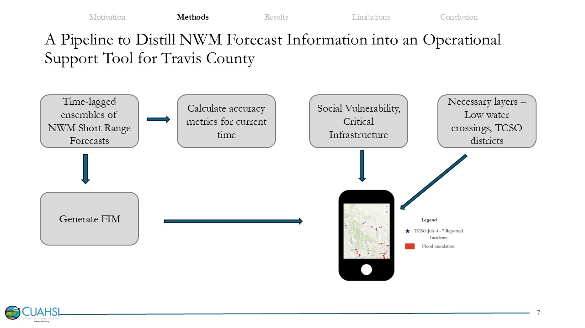

# Towards a Flood Navigation and Safety Decision Support Tool: A Pilot for Emergency Responders in Travis County, Texas 

### Authors
- **Kayode Adebayo**  
  *South Dakota State University*  
  [kayode.adebayo@jacks.sdstate.edu](mailto:kayode.adebayo@jacks.sdstate.edu)

- **Nana Oye Djan**  
  *Carnegie Mellon University*  
  [ndjan@andrew.cmu.edu](mailto:ndjan@andrew.cmu.edu)

- **Ali Farshid**  
  *Utah State University*  
  [ali.farshid@usu.edu](mailto:ali.farshid@usu.edu)

- **Saide Zand**  
  *University of Alabama*  
  [szand@crimson.ua.edu](mailto:szand@crimson.ua.edu)

- **David Maidment** ✳  
  *Professor Emeritus, University of Texas, Austin*  
  [maidment@utexas.edu](mailto:maidment@utexas.edu)

- **Kelsey McDonough** ✳  
  *FloodID® Product Lead, The Water Institute*  
  [mcdonough.kelseyr@gmail.com](mailto:mcdonough.kelseyr@gmail.com)

---

### Summary

In this study we demonstrate a pipeline to distilling hydrologic forecasts to county level for emergency responders with an operational decision support tool: **FLO-NAVSAFE**. By combining short-range forecasts from the **National Water Model (NWM)** with the **Height Above Nearest Drainage (HAND)** method, FLO-NAVSAFE generates **flood inundation maps (FIMs)** for near real-time, 1-, 2-, and 10-hour forecast horizons. Flood inundation uncertainty is addressed through **time-lagged ensembles** of NWM short-range (SR) forecasts, offering both **most-likely** and **worst-case scenarios** to better reflect operational risk.

###  Methodology

---

###  Project Team

